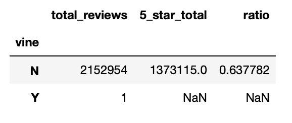

# Amazon Book Review Analysis 

## Overview

This analysis aims to use an Amazon book reviews dataset to determine whether there is a bias towards paid reviews based on the number of reviews and review ratings.

## Results

	* 2 152 954 non-Vine reviews; 64% (1 373 115) were 5 stars
	* 1 Vine review, 0% (0) 5 star 

## Summary

This dataset does not indicate whether there is a bias to paid reviews because of the lack of paid reviews. A different dataset would be required to determine a bias in review type based on the review in this dataset. However, the ratio of helpful votes to total votes by star rating could provide an indication of the quality of the review with an appropriately balanced dataset. A low proportion of helpful votes on paid reviews  would indicate a bias in paid reviews. 
